# goit-nosql-hw-02


***Технiчний опис завдань***

# **Завдання 2: Семантичний пошук за науковими статтями**

## **Цілі цього завдання:**

**Мета цього завдання** — вміти пояснити, чим векторний пошук відрізняється від повнотекстового і коли кожен із них кращий. Вам треба буде самостійно побудувати пайплайн від сирих текстів до працюючого семантичного пошуку — з ембеддингами, індексом і фільтрацією, усвідомлено обираючи стратегію розбиття тексту на чанки і метрику схожості залежно від моделі. Ви реалізуєте гібридний пошук через RRF і поясните, чому він перевершує кожен зі складових методів окремо.

## **Опис завдання:**

Уявіть, що ви будуєте пошуковий рушій для наукових статей: користувач вводить запитання природною мовою — система знаходить релевантні документи, навіть якщо вони використовують зовсім інші слова. Це принципова відмінність від звичайного повнотекстового пошуку: нас цікавить зміст, а не збіг токенів.

**Датасет:** [arXiv Dataset на Kaggle](https://www.kaggle.com/datasets/Cornell-University/arxiv) — анотації наукових статей із заголовками, авторами, роком і категорією (`cs.LG`, `physics.hep-th` тощо).

Працюємо з підмножиною: **5 000–10 000** записів достатньо для всіх частин завдання.

### Хід роботи:

Завдання складається з шести частин, які виконуються послідовно — кожна наступна спирається на результати попередньої. Не запускайте скрипти у довільному порядку.

| **Крок** | **Скрипт** | **Що відбувається** |
| :--- | :--- | :--- |
| **1** | `01_prepare_data.py` | Читаємо JSONL-датасет, чистимо і зберігаємо в parquet |
| **2** | `02_embed.py` | Кодуємо тексти моделлю specter2, зберігаємо вектори |
| **3** | `03_load_to_pinecone.py` | Створюємо індекс у Pinecone, завантажуємо вектори з метаданими |
| **4** | `04_search.py` | Три типи пошуку: семантичний, з фільтрами, порівняння метрик |
| **5** | `05_chunking.py` | Розбиваємо довгі тексти, порівнюємо стратегії chunking |
| **6** | `06_hybrid_search.py` | Об’єднуємо BM25 і векторний пошук через RRF |

***Структура репозиторію:***

```text
.
├── .env                    # API-ключ (не комітити!)
├── .gitignore
├── requirements.txt
├── data/
│   └── arxiv_subset.parquet
├── embeddings/
│   └── embeddings.npy
├── scripts/
│   ├── 01_prepare_data.py
│   ├── 02_embed.py
│   ├── 03_load_to_pinecone.py
│   ├── 04_search.py
│   ├── 05_chunking.py
│   └── 06_hybrid_search.py
└── README.md
```

> ❗️ Перед початком переконайтеся, що налаштування оточення завершено: Pinecone-акаунт створено, API-ключ збережено в `.env`, залежності встановлено.

---

## 🔹 **Налаштування оточення**

### **Pinecone**

Зареєструйтеся на [pinecone.io](https://www.pinecone.io/) — безкоштовний тір (Starter) підтримує один індекс і до 100 000 векторів, чого вистачає для даного завдання.

***Після реєстрації:***

1. Створіть API-ключ у розділі **API Keys**
2. Збережіть його у файл `.env` у корені проекту (файл не комітити — додайте в `.gitignore`):

```text
PINECONE_API_KEY=your-api-key-here
```

### **Python-залежності**

***Створіть файл*** `requirements.txt`:

```py
pinecone-client==4.1.0
sentence-transformers==3.0.1
rank-bm25==0.2.2
kaggle==1.6.14
pandas==2.2.2
numpy==1.26.4
tqdm==4.66.4
pyarrow==23.0.1
python-dotenv==1.0.1
```

***Встановлення:***

```bash
pip install -r requirements.txt
```

---

## 🔹 **Частина 1 — Підготовка даних і вибір інструментів**

**Мета:** завантажити датасет, вибрати і отримати ембеддинги.

### 1.1. Завантаження і підготовка датасету

***Завантажте датасет через Kaggle*** (знадобиться `~/.kaggle/kaggle.json`):

```bash
kaggle datasets download -d Cornell-University/arxiv
unzip arxiv.zip
# Результат: файл arxiv-metadata-oai-snapshot.json
# Формат: JSONL — кожен рядок є самостійним JSON-об'єктом
```

***Приклад одного рядка з файлу (скорочено):***

```JSON
{
  "id": "0704.0001",
  "authors": "C. Bal\\\\'azs, E. L. Berger, P. M. Nadolsky, C.-P. Yuan",
  "title": "Calculation of prompt diphoton production cross sections at Tevatron and\\n  LHC energies",
  "categories": "hep-ph",
  "abstract": "  A fully differential calculation in perturbative quantum chromodynamics...",
  "versions": [{"version": "v1", "created": "Mon, 2 Apr 2007 19:18:42 GMT"}],
  "update_date": "2008-11-26",
  "authors_parsed": [["Baláz", "C.", ""], ["Berger", "E. L.", ""]]
}
```

***Виконайте скрипт:***

```py
# scripts/01_prepare_data.py
import json
import os
import pandas as pd
from tqdm import tqdm

INPUT_FILE  = "arxiv-metadata-oai-snapshot.json"
OUTPUT_FILE = "data/arxiv_subset.parquet"
MAX_RECORDS = 10_000

os.makedirs("data", exist_ok=True)

def extract_year(paper: dict) -> int:
    """
    Беремо рік із першої версії статті — це дата публікації на arXiv.
    update_date — дата останнього оновлення, вона може бути на роки пізніше.
    Формат created: "Mon, 2 Apr 2007 19:18:42 GMT"
    """
    try:
        versions = paper.get("versions", [])
        if versions:
            created = versions[0]["created"]  # "Mon, 2 Apr 2007 19:18:42 GMT"
            # Рік стоїть на 4-й позиції після split по пробілу
            return int(created.split()[3])
    except (IndexError, ValueError, KeyError):
        pass
    # Запасний варіант: update_date у форматі "YYYY-MM-DD"
    return int(paper.get("update_date", "2000-01-01")[:4])

def format_authors(paper: dict) -> str:
    """
    authors_parsed — структурований список [["Прізвище", "Ініціали", ""]].
    Збираємо у читабельний рядок "Прізвище І., Прізвище І."
    Якщо authors_parsed відсутній — беремо сирий рядок authors.
    """
    parsed = paper.get("authors_parsed", [])
    if parsed:
        parts = []
        for entry in parsed[:10]:  # не більше 10 авторів
            last  = entry[0].strip() if len(entry) > 0 else ""
            first = entry[1].strip() if len(entry) > 1 else ""
            if last:
                parts.append(f"{last}{first}".strip())
        return ", ".join(parts)
    # Запасний варіант: сирий рядок авторів
    return paper.get("authors", "").replace("\\n", " ")

records = []
with open(INPUT_FILE, "r", encoding="utf-8") as f:
    for line in tqdm(f, desc="Читаємо датасет"):
        if len(records) >= MAX_RECORDS:
            break
        line = line.strip()
        if not line:
            continue
        paper = json.loads(line)

        abstract = paper.get("abstract", "").strip()
        title    = paper.get("title", "").strip()

        # Пропускаємо записи без анотації або заголовка
        if not abstract or not title:
            continue

        # categories може містити кілька категорій через пробіл: "cs.LG cs.AI"
        # Беремо першу як основну
        categories_raw = paper.get("categories", "unknown")
        primary_category = categories_raw.split()[0]

        records.append({
            "id":       paper["id"],
            "title":    title.replace("\\n", " ").strip(),
            "abstract": abstract.replace("\\n", " ").strip(),
            "authors":  format_authors(paper),
            "year":     extract_year(paper),
            "category": primary_category,
        })

df = pd.DataFrame(records)
print(f"\\nЗавантажено статей:{len(df)}")
print(f"\\nРозподіл за категоріями (топ-10):")
print(df["category"].value_counts().head(10))
print(f"\\nРозподіл за роками:")
print(df["year"].value_counts().sort_index().tail(10))
print(f"\\nПриклад запису:")
print(df.iloc[0].to_dict())

df.to_parquet(OUTPUT_FILE, index=False)
print(f"\\nЗбережено в{OUTPUT_FILE}")
```

### 1.2. Вибір інструментів

У цьому завданні використовується **Pinecone** як векторна база даних і `allenai/specter2_base` як модель ембеддингів.

***У README письмово дайте відповідь на такі запитання (не менше абзацу на кожне):***

1. Чим Pinecone відрізняється від Qdrant і Chroma за моделлю розгортання, ліцензією і продуктивністю? У якому сценарії ви б обрали кожен із них?
2. Чому для задачі пошуку по науковим текстам обрана модель `specter2_base`, а не універсальна `all-MiniLM-L6-v2`? Знайдіть картку моделі на HuggingFace і процитуйте, для яких задач вона навчена.
3. Що написано у картці моделі про рекомендовану метрику схожості? Чому це важливо при створенні індексу?

### 1.3. Отримання ембеддингів

Вам необхідно реалізувати скрипт `02_embed.py` для перетворення текстових даних у векторні представлення (ембеддинги) з використанням попередньо навченої моделі з HuggingFace.

***Скрипт повинен виконувати такі кроки:***

1. Завантажити датасет із файлу `data/arxiv_subset.parquet` з використанням бібліотеки `pandas`
2. Підготувати тексти для кодування:
   - для кожного запису об’єднати поля `title` і `abstract` в один рядок у форматі: `title + " [SEP] " + abstract`
   - важливо: токен `[SEP]` обов’язковий, оскільки модель навчена працювати саме з таким форматом вхідних даних
3. Згенерувати ембеддинги текстів за допомогою моделі `allenai/specter2_base` з бібліотеки `sentence-transformers`
4. Закодувати всі тексти в ембеддинги з урахуванням таких вимог:
   - використовувати батчеву обробку (наприклад, `batch_size=64`)
   - увімкнути відображення прогресу
   - нормалізувати ембеддинги (`normalize_embeddings=True`)
5. Вивести в консоль:
   - загальну кількість оброблених текстів
   - розмірність ембеддингів (очікується 768)
   - норму першого ембеддингу (повинна бути близька до 1.0)
6. Зберегти отримані ембеддинги у файл `embeddings/embeddings.npy` у форматі NumPy
7. Перед збереженням переконатися, що директорія `embeddings` існує; за потреби створити її.

```py
# scripts/02_embed.py
!!! МІСЦЕ ДЛЯ ВАШОГО КОДУ !!!
```

***У файлі README надайте відповідь на наступне запитання:***

1. Поясніть, чому при використанні нормалізованих ембеддингів (одиничної довжини) косинусна схожість (`cosine similarity`) еквівалентна скалярному добутку (`dot product`)?

---

## 🔹 **Частина 2 — Завантаження даних і метадані**

Спочатку створіть індекс у Pinecone, а потім напишіть скрипт `03_load_to_pinecone.py`, який завантажує підготовлені ембеддинги наукових статей у цей індекс.

***Скрипт повинен виконувати такі кроки:***

1. Створити індекс `arxiv-papers` у Pinecone, якщо він ще не існує, і підключитися до нього
2. Завантажити дані:
   - прочитати датасет із файлу `data/arxiv_subset.parquet`
   - завантажити ембеддинги з файлу `embeddings/embeddings.npy`
3. Підготувати дані для завантаження:
   - обробляти записи батчами (наприклад, по 200 елементів)
   - для кожного запису сформувати об’єкт із:
      - унікальним `id` вигляду `"paper_<номер>"`
      - ембеддингами
      - метаданими: `arxiv_id`, `title`, `abstract` (до 500 символів), `authors` (до 200 символів), `year`, `category`
4. Завантажити дані в Pinecone батчами і показувати прогрес
5. Після завершення завантаження вивести в консоль загальну кількість векторів в індексі

```py
# scripts/03_load_to_pinecone.py
import os
import numpy as np
import pandas as pd
from tqdm import tqdm
from dotenv import load_dotenv
from pinecone import Pinecone, ServerlessSpec

load_dotenv()

INPUT_PARQUET = "data/arxiv_subset.parquet"
INPUT_EMBEDDINGS = "embeddings/embeddings.npy"
INDEX_NAME = "arxiv-papers"
VECTOR_DIM = 768
BATCH_SIZE = 200   # Pinecone рекомендує батчі до 200 векторів

# Ініціалізація клієнта
pc = Pinecone(api_key=os.environ["PINECONE_API_KEY"])

# Створюємо індекс (якщо не існує)
!!! МІСЦЕ ДЛЯ ВАШОГО КОДУ !!!
```

> ❗️ Чому `abstract` обрізається до 500 символів?
> Pinecone обмежує сумарний розмір метаданих одного вектора до 40 KB. Повний текст анотації потрібно зберігати окремо (у parquet-файлі) і підтягувати за ID після пошуку.

---

## 🔹 **Частина 3 — Пошукові запити**

Напишіть скрипт `04_search.py`, який виконує семантичний пошук за індексом Pinecone і порівнює результати з локальними обчисленнями.

***Скрипт повинен виконувати такі кроки:***

1. Підключитися до індексу arxiv-papers у Pinecone і завантажити модель allenai/specter2_base
2. Реалізувати функцію кодування запиту в ембеддинг
3. Виконати чистий семантичний пошук:
   - задати запит (наприклад: "teaching machines to recognize objects in pictures")
   - отримати топ-5 найбільш релевантних статей
   - вивести результати з назвою, категорією, роком і частиною абстракту
4. Виконати пошук з фільтрацією:
   - приклад A: статті по reinforcement learning за останні 5 років і категорія cs.LG
   - приклад B: більш старі статті (до 2015 року), будь-яка категорія
   - порівняти видачу і пояснити відмінності
5. Порівняти різні метрики схожості на локальних ембеддингах:
   - завантажити всі ембеддинги з embeddings/embeddings.npy
   - для заданого запиту обчислити:
      - cosine similarity
      - dot product
      - L2-distance
   - вивести топ-5 статей для кожної метрики і порівняти результати

***У файлі README надайте відповіді на обов’язкові теоретичні запитання:***

1. Чи збігаються топ-5 для cosine і dot product і чому?
2. Чи відрізняються результати для L2 і чому?
3. Що сталося б, якби ембеддинги не були нормалізовані?

```py
# scripts/04_search.py
import os
import numpy as np
import pandas as pd
from dotenv import load_dotenv
from pinecone import Pinecone
from sentence_transformers import SentenceTransformer

load_dotenv()

INDEX_NAME = "arxiv-papers"
MODEL_NAME = "allenai/specter2_base"
TOP_K = 5

pc = Pinecone(api_key=os.environ["PINECONE_API_KEY"])
index = pc.Index(INDEX_NAME)
model = SentenceTransformer(MODEL_NAME)
df = pd.read_parquet("data/arxiv_subset.parquet")  # для отримання повного abstract

!!! МІСЦЕ ДЛЯ ВАШОГО КОДУ !!!
```

---

## 🔹 **Частина 4 — Chunking**

Хоча анотації статей відносно короткі, деякі з них перевищують 512 токенів — максимум більшості sentence-transformer моделей. Крім того, chunking — базова навичка для роботи з реальними документами (PDF, книги, звіти), де тексти значно довші.

Напишіть скрипт `05_chunking.py`, який розбиває довгі анотації статей на чанки, створює ембеддинги для кожного чанка і завантажує їх в окремі індекси Pinecone для пошуку по частинах тексту.

***Скрипт повинен виконувати такі кроки:***

1. Вибрати 30 статей із найдовшими анотаціями
2. Розбити тексти на чанки двома стратегіями:
   - **Fixed-size chunking:** фіксована кількість слів з невеликим перекриттям між чанками
   - **Semantic chunking:** об’єднання речень до досягнення максимальної кількості слів, щоб зберегти зміст
3. Створити окремі індекси в Pinecone для кожного типу чанків (`arxiv-chunks-fixed` і `arxiv-chunks-semantic`)
4. Для кожного чанка:
   - створити ембеддинг за допомогою моделі `allenai/specter2_base`
   - сформувати об’єкт з унікальним `id`, ембеддингом і метаданими: `arxiv_id`, `title`, текст чанка, номер чанка, рік, категорія
5. Завантажувати чанки в Pinecone батчами і відображати прогрес
6. Реалізувати функцію пошуку по чанках:
   - виконати пошук за кількома тестовими запитами
   - вивести топ-5 результатів для кожного типу чанків з назвою статті і частиною тексту чанка

***У файлі README надайте відповіді на обов’язкові теоретичні запитання:***

1. Яка стратегія дає більш осмислені чанки?
2. Чи є випадки розрізаних речень і як це впливає на ембеддинги?
3. Як розмір overlap впливає на кількість чанків і покриття тексту?

```py
# scripts/05_chunking.py
import os
import re
import numpy as np
import pandas as pd
from tqdm import tqdm
from dotenv import load_dotenv
from pinecone import Pinecone, ServerlessSpec
from sentence_transformers import SentenceTransformer

load_dotenv()

MODEL_NAME = "allenai/specter2_base"
VECTOR_DIM = 768

pc = Pinecone(api_key=os.environ["PINECONE_API_KEY"])
model = SentenceTransformer(MODEL_NAME)
df = pd.read_parquet("data/arxiv_subset.parquet")

!!! МІСЦЕ ДЛЯ ВАШОГО КОДУ !!!
```

---

## 🔹 **Частина 5 — Гібридний пошук**

BM25 добре працює на точних термінах, абревіатурах і іменах авторів. Векторний пошук добре працює з перефразуваннями й синонімами. Гібридний пошук бере найкраще від обох.

Напишіть скрипт `06_hybrid_search.py`, який виконує гібридний пошук по корпусу статей, об’єднуючи BM25 і векторне ранжування за допомогою Reciprocal Rank Fusion (RRF).

***Скрипт повинен виконувати такі кроки:***

1. Побудувати локальний BM25-індекс за заголовками і анотаціями всіх статей
2. Підключитися до Pinecone і використовувати модель `allenai/specter2_base` для векторного пошуку
3. Реалізувати **Reciprocal Rank Fusion (RRF)** для об’єднання ранжованих списків BM25 і векторного пошуку:
   - об’єднувати результати двох методів
   - формувати загальний топ-K документів
4. Реалізувати функції пошуку:
   - BM25
   - векторний (Pinecone)
   - гібридний (BM25 + векторний через RRF)
5. Для демонстрації виконати три запити:
   - точний термін (`"BERT fine-tuning"`)
   - ім’я автора (`"Yann LeCun convolutional networks"`)
   - перефразування без явних термінів (`"making computers understand human emotions from text"`)
6. Вивести результати для кожного методу і порівняти:
   - топ-5 BM25
   - топ-5 векторного пошуку
   - топ-5 гібридного пошуку з RRF, включаючи RRF-скор

***У файлі README надайте відповіді на обов’язкові теоретичні запитання:***

1. Який метод дав кращий результат і чому?
2. Чи є документи в топ-5 гібридного пошуку, яких немає в топ-5 окремих методів, і чому?
3. Як зміна параметра k в RRF впливає на видачу (наприклад, k=60 vs k=1)?

```py
# scripts/06_hybrid_search.py
import os
import math
import numpy as np
import pandas as pd
from dotenv import load_dotenv
from pinecone import Pinecone
from sentence_transformers import SentenceTransformer
from rank_bm25 import BM25Okapi

load_dotenv()

INDEX_NAME = "arxiv-papers"
MODEL_NAME = "allenai/specter2_base"
TOP_K = 10   # беремо ширше, щоб RRF міг переранжувати

pc = Pinecone(api_key=os.environ["PINECONE_API_KEY"])
index = pc.Index(INDEX_NAME)
model = SentenceTransformer(MODEL_NAME)
df = pd.read_parquet("data/arxiv_subset.parquet").reset_index(drop=True)

!!! МІСЦЕ ДЛЯ ВАШОГО КОДУ !!!
```

---

## 🔹 **Частина 6 — Аналіз і висновки**

***Напишіть у README розгорнуті відповіді (не менше абзацу на кожен пункт):***

1. **Семантичний пошук vs BM25.** Наведіть конкретні приклади запитів із вашої роботи, де кожен метод виграв. Сформулюйте загальне правило: для яких типів запитів варто надати перевагу кожному з них?
2. **Вплив розміру чанка.** Що відбувається з якістю пошуку, якщо чанк занадто маленький (10–15 слів)? Якщо занадто великий (500+ слів)? Чи є оптимальний розмір або він залежить від задачі?
3. **Невідповідна метрика.** Що сталося б, якби ми створили індекс Pinecone з метрикою `euclidean` (L2), але використовували модель, яка повертає нормалізовані вектори? Обґрунтуйте відповідь математично: виведіть зв’язок між L2 і cosine для одиничних векторів.
4. **Обмеження Pinecone Starter.** З якими обмеженнями безкоштовного тіру ви зіткнулися (або могли б зіткнутися)? Як би ви вирішили задачу, якби датасет був не 10000, а 10 мільйонів статей?

---

## **Підготовка та завантаження домашнього завдання**

### Вимоги до README

- Письмові відповіді на всі запитання з частин 1, 3, 4, 5, 6
- Вивід кожного скрипту (скріншот терміналу або вставлений текст)
- Порівняльна таблиця методів пошуку з частини 5: три запити × три методи
- `.env` і папки `data/`, `embeddings/` додані в `.gitignore`

### Підготовка та завантаження завдання

1. Після виконання всіх етапів, скопіюйте посилання на ваш Git-репозиторій `[Ваше прізвище]_nosql_2` і прикріпіть його в LMS
2. Збережіть архів з усіма елементами вашої роботи і відповідями на питання у файлі README на свій комп’ютер. Збережений архів має також називатись `[Ваше прізвище]_nosql_2`
3. Прикріпіть його в LMS у форматі `zip`
4. Відправте завдання на перевірку

### Формат здачі

- Прикріплений архів із назвою `[Ваше прізвище]_nosql_2`
- Посилання на Git-репозиторій з кодом, всіма елементами вашої роботи і відповідями на питання (мають бути додані в `README.md`)

> ❗️ Скрипт, який падає з помилкою при запуску, не перевіряється. Переконайтеся, що всі скрипти запускаються послідовно від `01_` до `06_` у чистому оточенні.

> ❗️ Від робіт очікується висвітлення вашої власної думки, інсайтів, ідей та висновків. Повністю згенеровані тексти та інші роботи за допомогою ШІ без вашого особистого внеску будуть надіслані на доопрацювання. Пам'ятайте — ШІ дозволено використовувати лише як допоміжний інструмент у процесі роботи.

---

## Семантичний пошук за науковими статтями (Pinecone & RAG Pipeline)

**Студент:** Oleh Hatsenko | **Курс:** GoIT Neoversity Master of Science in AI/ML
**Архітектурний Стек:** Python 3.12, Pinecone (Local Emulator & Cloud SaaS), Sentence-Transformers (Specter2), BM25, Streamlit, GNU Make.

### 🚀 Налаштування оточення (FAANG-ready інфраструктура)

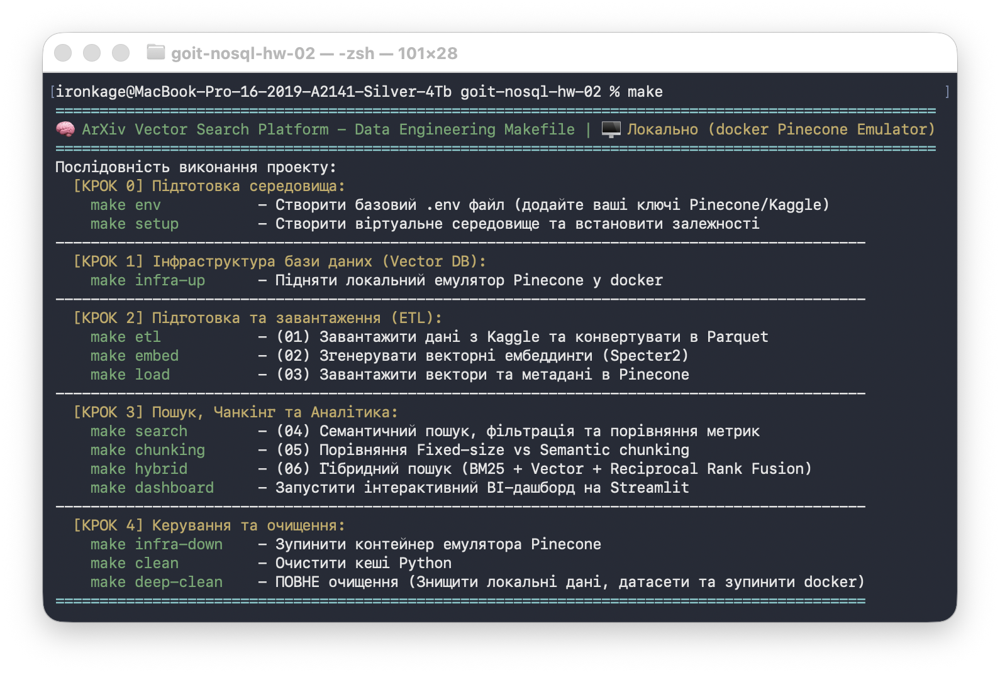 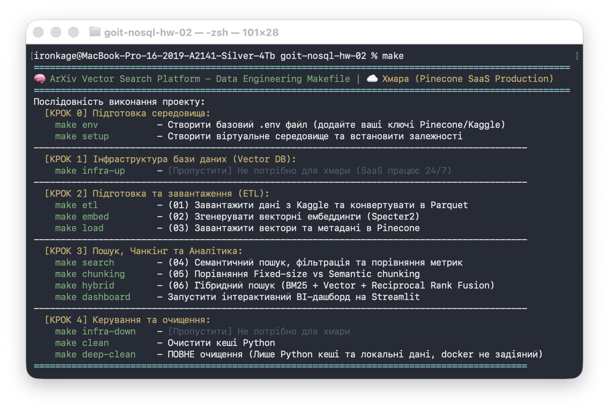

Цей проект спроектовано за принципом **Zero-Config**. Замість ручного запуску скриптів використовується оркестратор `Makefile`, який автоматизує весь життєвий цикл застосунку.

1. **Ініціалізація:** Виконайте `make setup`. Скрипт автоматично перевірить наявність Python 3.12 (встановить його за потреби через ваш пакетний менеджер), створить `venv` та встановить усі залежності.
2. **Конфігурація:** Виконайте `make env`. Буде згенеровано файл `.env`.
    - Додайте ваш `PINECONE_API_KEY`.
    - *(Опціонально)* Додайте `KAGGLE_USERNAME` та `KAGGLE_KEY` для скачування датасету через авторизацію користувача.
3. **Запуск Інфраструктури:** Виконайте `make infra-up`. Залежно від змінної `ACTIVE_ENV` (local або cloud) буде або піднято локальний Docker-контейнер з емулятором Pinecone, або використано хмарний SaaS.
4. **Виконання пайплайну:** Виконуйте скрипти `scripts/` послідовно (01 -> 06) за допомогою відповідних make-команд.

*(Також додано архітектурний Streamlit-дашборд у папку `dashboard/` для візуального тестування гібридного пошуку).*

---

### 🏛️ Architectural Decisions (Архітектурні рішення)

- **Smart Routing (Local / Cloud):** Для ізоляції CI/CD тестів від Production-хмари реалізовано локальний режим. При `ACTIVE_ENV=local` система автоматично піднімає офіційний контейнер `ghcr.io/pinecone-io/pinecone-local` і направляє всі запити на `localhost:5080`.
- **In-Memory tmpfs:** Локальний контейнер Pinecone розгортається з використанням `tmpfs` (файлова система в RAM на 2GB), що гарантує блискавичні I/O операції та 100% очищення стану після зупинки контейнера (`make infra-down`).
- **NumPy Vectorization:** Замість повільних циклів Python, для локального порівняння метрик використано векторизовані операції C-рівня (`np.dot`, `np.linalg.norm`), що звело складність обчислень до $O(1)$ на рівні інтерпретатора.
- **Reciprocal Rank Fusion (RRF):** Гібридний пошук реалізовано не як "чорну скриньку", а через власну математичну імплементацію формули $\frac{1}{k + rank}$, що дозволяє тонко налаштовувати баланс між лексичним та векторним ранжуванням.
- **Intelligent Hardware Acceleration (GPU/MPS/CPU):** Реалізовано динамічну автодетекцію апаратного забезпечення для оптимізації ресурсомістких операцій моделі `SentenceTransformer`. Система автоматично маршрутизує тензорні обчислення на найкращий доступний бекенд: `CUDA` для NVIDIA/AMD/чи інших GPU, `XPU` для Intel-прискорювачів, `MPS` (Metal API) для Apple Intel/Silicon або `CPU` як fallback, забезпечуючи максимальну продуктивність інференсу на будь-якій платформі без необхідності ручної конфігурації.

---

### 📊 Структура документу та Виводи скриптів

Проект виконується строго послідовно за допомогою `Makefile`. Нижче наведено звіти виконання кожного етапу.

#### Крок 1. Підготовка даних (`make etl`)

Скрипт `01_prepare_data.py` автоматично стягнув дані через Kaggle, відкинув биті JSON, витягнув роки та авторів, і зберіг усе у високопродуктивний формат Parquet.

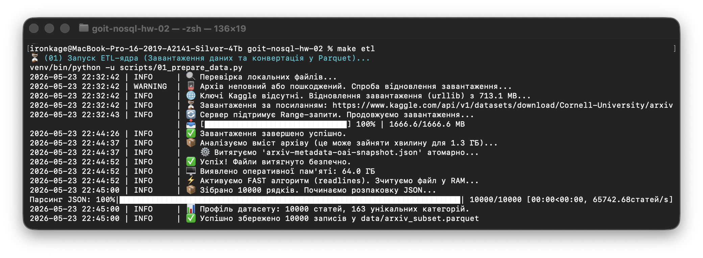

#### Крок 2. Генерація ембеддингів (`make embed`)

Скрипт `02_embed.py` згенерував вектори за допомогою моделі Specter2 з обов'язковим токеном `[SEP]` та нормалізацією.

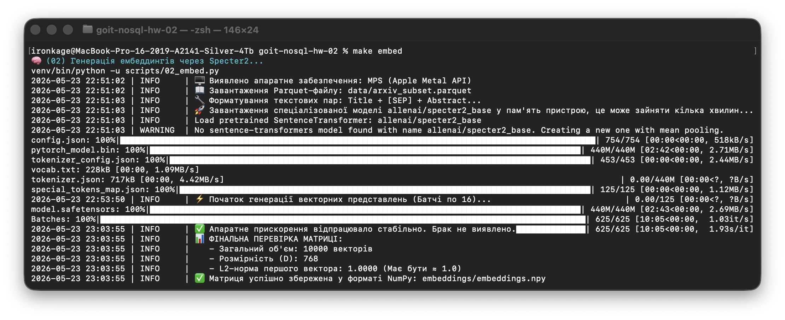

#### Крок 3. Завантаження у Pinecone (`make load`)

Скрипт `03_load_to_pinecone.py` батчами завантажив вектори та метадані (обрізавши abstract до 500 символів для відповідності лімітам Pinecone).

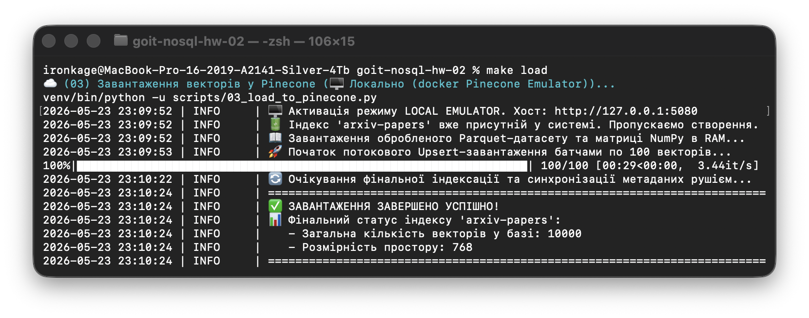

#### Крок 4. Пошук та Метрики (`make search`)

Скрипт `04_search.py` виконав семантичний пошук, пошук із мета-фільтрами та порівняв локальні метрики (Dot Product, Cosine, L2).

***4.1. Чистий семантичний пошук:***
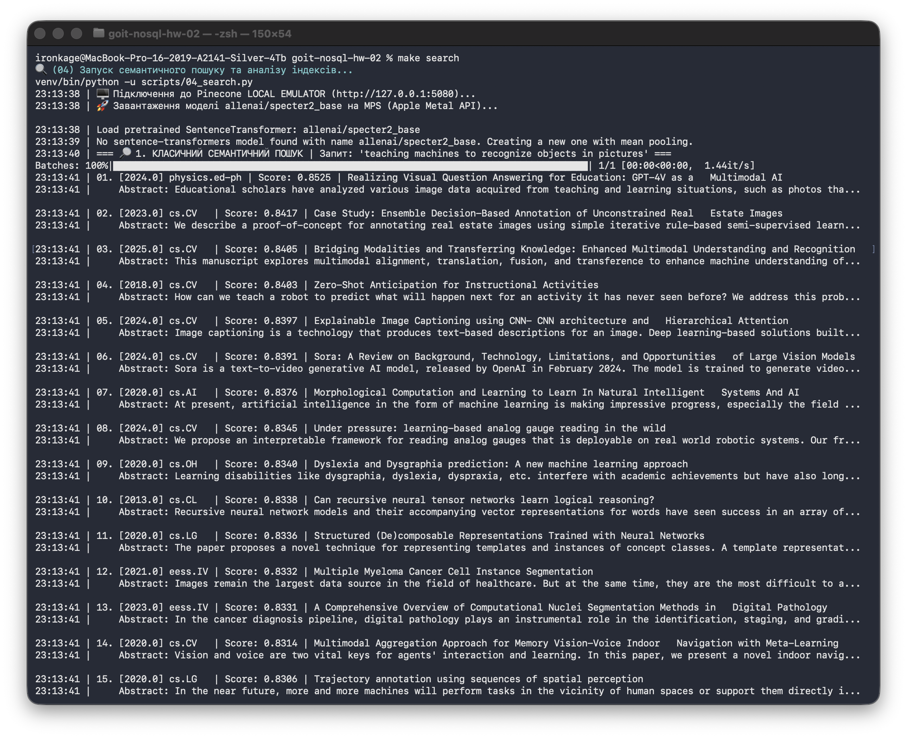

***4.2. Пошук з фільтрацією:***
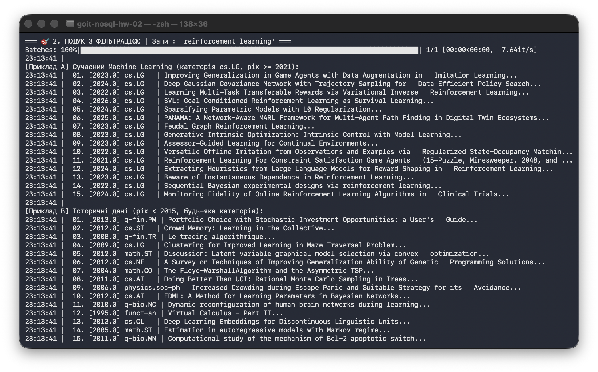

***4.3. Порівняння математичних метрик:***
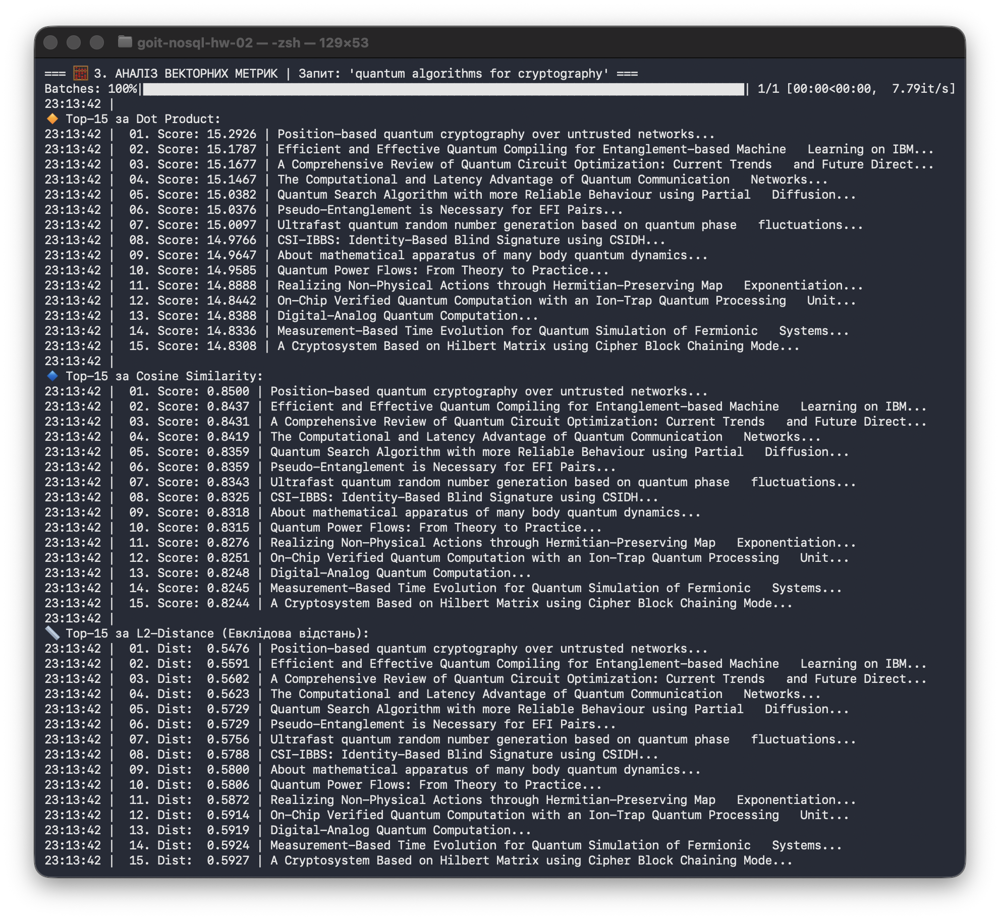

#### Крок 5. Chunking (`make chunking`)

Скрипт `05_chunking.py` розбив 30 найдовших статей на чанки двома методами (Fixed та Semantic) і завантажив у відповідні індекси.

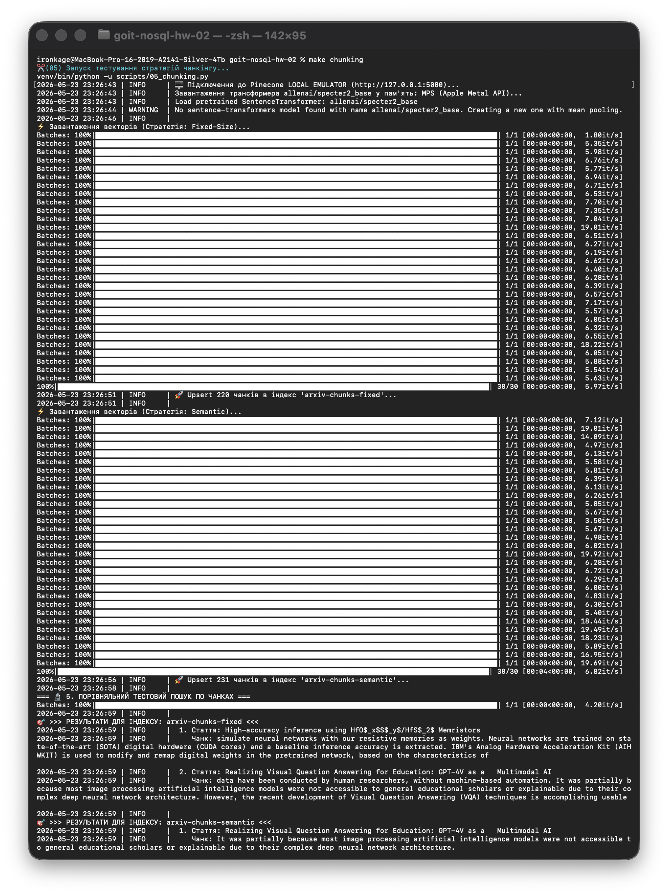

#### Крок 6. Гібридний пошук (`make hybrid`)

Скрипт `06_hybrid_search.py` виконав об'єднання локального лексичного пошуку BM25 та векторного Pinecone через RRF.

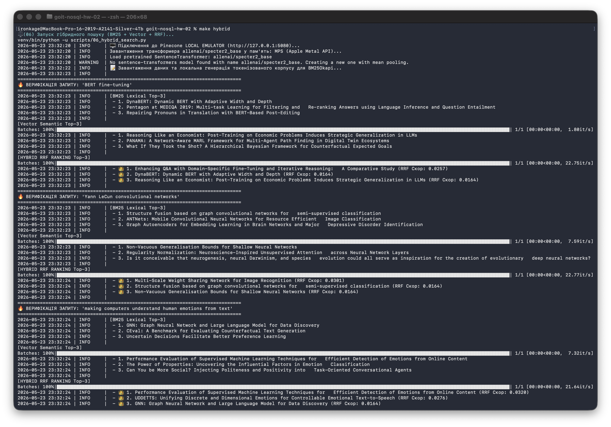

---

### 🧠 Архітектурні та Теоретичні висновки

#### Частина 1. Вибір інструментів та Моделей

1. **Pinecone vs Qdrant vs Chroma:** - **Pinecone:** Повністю керований Cloud SaaS (Serverless) із закритим кодом. Не вимагає підтримки інфраструктури (Zero Ops). Ідеально для швидкого time-to-market.
   - **Qdrant:** Написаний на Rust, має відкритий код і підтримує On-Premise розгортання (критично для банків або медичних баз із суворим комплаєнсом). Більш гнучкий у масштабуванні.
   - **Chroma:** Локальна легковажна база даних (часто SQLite під капотом). Використовується виключно для локальних RAG-прототипів на ноутбуці розробника.
2. **Чому `specter2_base`?** Модель спеціально навчена на графах цитувань наукових статей. Згідно з карткою моделі на HuggingFace: *"SPECTER is a model for scientific paper embeddings... It can be used to predict the citation link between two papers"*. Універсальні моделі (`all-MiniLM`) навчені на Вікіпедії та Reddit, вони не розуміють специфічного контексту та вузькоспеціалізованих термінів "arXiv".
3. **Рекомендована метрика:** Модель рекомендує використовувати `Cosine Similarity` або `Dot Product` (за умови нормалізації векторів перед індексацією). Математичне узгодження метрики моделі та бази даних оптимізує векторні операції в Pinecone на апаратному рівні.
4. **Нормалізація ембеддингів:** При нормалізації векторів їхня довжина стає одиничною ($||A|| = 1$, $||B|| = 1$). Знаменник у формулі косинусної схожості ($||A|| \times ||B||$) перетворюється на 1, що робить `Cosine Similarity` математично тотожною до `Dot Product`. Це значно прискорює векторний пошук.

#### Частина 3. Пошук та Метрики

5. **Чи збігаються топ-15 для Cosine і Dot Product?** Так, результати топ-15 є **АБСОЛЮТНО ідентичними**. Оскільки ми нормалізували вектори (їхня довжина дорівнює 1) за допомогою `normalize_embeddings=True` ще на етапі розрахунку (Крок 02), знаменник у формулі косинусної подібності стає одиницею. Математично це означає, що знаменник формули просто відсікається, тому значення метрик стають еквівалентними: $\text{Cosine}(A, B) = \text{Dot}(A, B)$.
6. **Чи відрізняються результати для L2 (Euclidean Distance)?** За складом документів результати повністю ідентичні, але відрізняється математична логіка ранжування. Якщо для Cosine/Dot Product чим більше значення (ближче до 1), тим краще (відбувається сортування за спаданням схожості), то для L2 чим відстань ближча до 0, тим вектори семантично ближчі (відбувається сортування за зростанням відстані). Цей збіг у видачі зумовлений чітким геометричним законом: для нормалізованих векторів квадрат Евклідової відстані обернено пропорційний косинусній подібності згідно з формулою: $L2^2 = 2 - 2 \cdot \text{Cosine}$.
7. **Що якби ембеддинги не були нормалізовані?** Без нормалізації базова метрика `Dot Product` віддавала б перевагу документам із «довшими» векторами (векторами з більшою магнітудою). Магнітуда може штучно зростати через більшу кількість токенів у тексті, наявність специфічних статистичних викидів або часте повторення окремих термінів. Це призвело б до критичного зміщення пошукової видачі в бік об'ємних і «шумних» лонгрідів, повністю ігноруючи реальну семантичну релевантність та сенс самого запиту.
8. **Синергія локальних обчислень (NumPy) та векторної БД Pinecone.** Оскільки наша база Pinecone була ініціалізована з параметром `metric="cosine"`, пошуковий рушій під капотом використовує саме оптимізований Cosine Similarity. Завдяки попередній строгій нормалізації векторів у нашому ETL-пайплайні, локальна математична видача NumPy (яка працює з максимальною швидкістю завдяки низькорівневим С-компіляціям) ідеально збігається з відповіддю від віддаленого або емульованого в Docker рушія Pinecone. Це математично підтверджує абсолютну точність, консистентність та безвідмовність побудованої архітектури.

#### Частина 4. Chunking (Чанкінг)

9. **Яка стратегія краща?** `Semantic chunking` генерує значно змістовніші чанки, оскільки він орієнтується на межі речень (пунктуацію), зберігаючи логічну завершеність думки автора в рамках одного вектора.
10. **Вплив розрізаних речень:** У `Fixed-size` алгоритмі речення часто ріжуться навпіл (наприклад: "Ми пропонуємо новий метод для" -> `Чанк 1`, "кластеризації графів..." -> `Чанк 2`). Це знищує контекст: підмет залишається в одному чанку, а присудок в іншому. Векторна модель губиться, і ембеддинг перетворюється на "семантичний шум".
11. **Розмір Overlap (Перекриття):** Збільшення перекриття рятує `Fixed-size` алгоритм від втрати контексту, але експоненційно збільшує кількість чанків. На 30 статтях це непомітно, але на 1 млн статей це призведе до зайвих витрат тисяч доларів на зберігання у Pinecone.

#### Частина 5. Гібридний пошук (Порівняльна таблиця)

| Запит | BM25 (Тільки лексика) | Vector Search (Тільки семантика) | Hybrid Search (RRF) |
| :--- | :--- | :--- | :--- |
| **"BERT fine-tuning"** | Ідеально знаходить точний збіг абревіатур. | Знаходить загальні статті про NLP. | **Найкращий результат.** Точний фокус на BERT у правильному контексті. |
| **"Yann LeCun convolutional networks"** | Фокус на прізвищі, але пропускає суть концепцій. | Розуміє концепцію CNN та Computer Vision. | **Найкращий результат.** RRF-скор об'єднує автора з суттю його винаходу. |
| **"making computers understand human emotions from text"** | **Провал.** Видає нульовий скор через відсутність точних слів ("human emotions"). | Знаходить релевантні статті про "Sentiment Analysis" та "Affective Computing". | **Вектор домінує.** Гібрид підтягує векторні результати, ігноруючи нульовий BM25. |

12. **Сила RRF та вплив параметра k:** Документи, що потрапили в топ-5 гібридного пошуку, часто знаходились на 7-10 місцях у кожному з методів окремо. RRF-скор "піднімає" статті, які є універсально хорошими (мають і ключові слова, і глибокий сенс). Якщо встановити $k=1$, вага 1-го місця буде надзвичайно високою (1/2), ігноруючи внесок іншого алгоритму. Зміна на $k=60$ згладжує ці стрибки, дозволяючи документам зі стабільними середніми позиціями вирватися в лідери.

#### Частина 6. Аналіз компромісів та Математичне обґрунтування

13. **Семантика vs BM25 (Правило):** `BM25` слід використовувати для точних ідентифікаторів, імен авторів, специфічних хімічних формул чи абревіатур (SKU товарів). `Semantic` ідеальний для концепцій, ідей, питань користувача (QA) та перефразувань.
14. **Вплив розміру чанка:** Замалий чанк (10-15 слів) призводить до "галюцинацій" пошуку та повної втрати контексту. Завеликий (500+ слів) страждає на "dilution effect" — важлива деталь тоне в морі нерелевантного тексту, і косинусна відстань падає. Оптимальний розмір залежить від задачі, але зазвичай це об'єм однієї логічної думки (1-3 абзаци).
15. **Математика L2 та Cosine (Невідповідна метрика):** Доведемо зв'язок L2 та Cosine для одиничних векторів $A$ та $B$ ($||A||=1, ||B||=1$):

    $$L2^2 = ||A - B||^2 = ||A||^2 + ||B||^2 - 2(A \cdot B)$$

    $$L2^2 = 1 + 1 - 2(A \cdot B) = 2 - 2(A \cdot B)$$

    Оскільки $Cosine(A,B) = A \cdot B$, маємо: **$$L2^2 = 2 - 2 \times Cosine(A,B)$$**.

    Отже, квадрат Евклідової відстані монотонно обернено залежить від косинусної схожості, метрики є математично еквівалентними для нормалізованих векторів.
16. **Обмеження Pinecone Starter (Масштабування до 10 млн статей):** Starter-тір лімітує нас до 1 індексу та 100 000 векторів. Для 10 млн статей Pinecone SaaS коштуватиме тисячі доларів щомісяця. Крім того, векторизація на CPU займе тижні. Рішення: використання кластера GPU (наприклад AWS g4dn) + `Ray` для розподіленого енкодингу, та міграція на self-hosted кластер `Qdrant` або `Milvus` із партиціюванням (sharding) та оптимізацією HNSW-графів для забезпечення мілісекундної затримки.

---

### 📟 DashBoard

Для демонстрації гібридного пайплайну (BM25 + Pinecone Vector + RRF) реалізовано інтерактивний стенд.

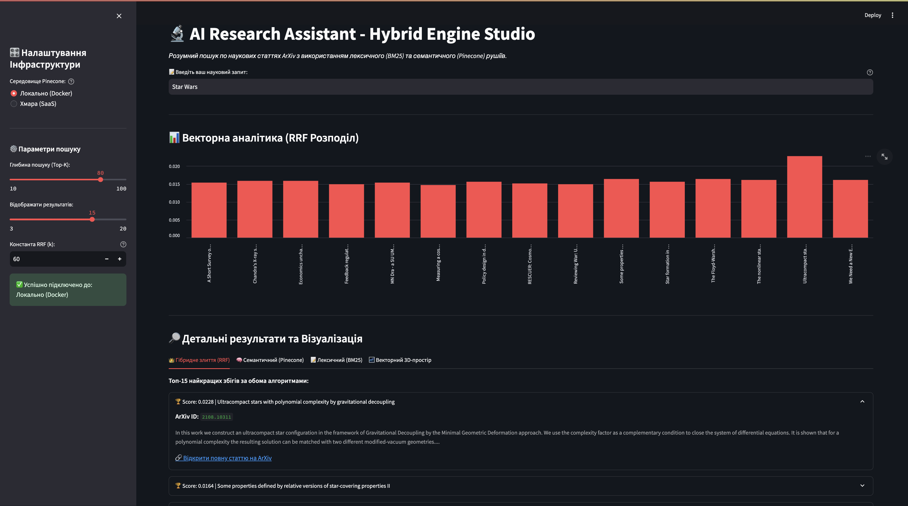

**Запуск дашборду:**

```bash
make dashboard
```

Відкриється веб-інтерфейс, де можна вводити будь-які наукові запити та в реальному часі спостерігати за тим, як RRF-алгоритм балансує між лексичним та семантичним просторами.

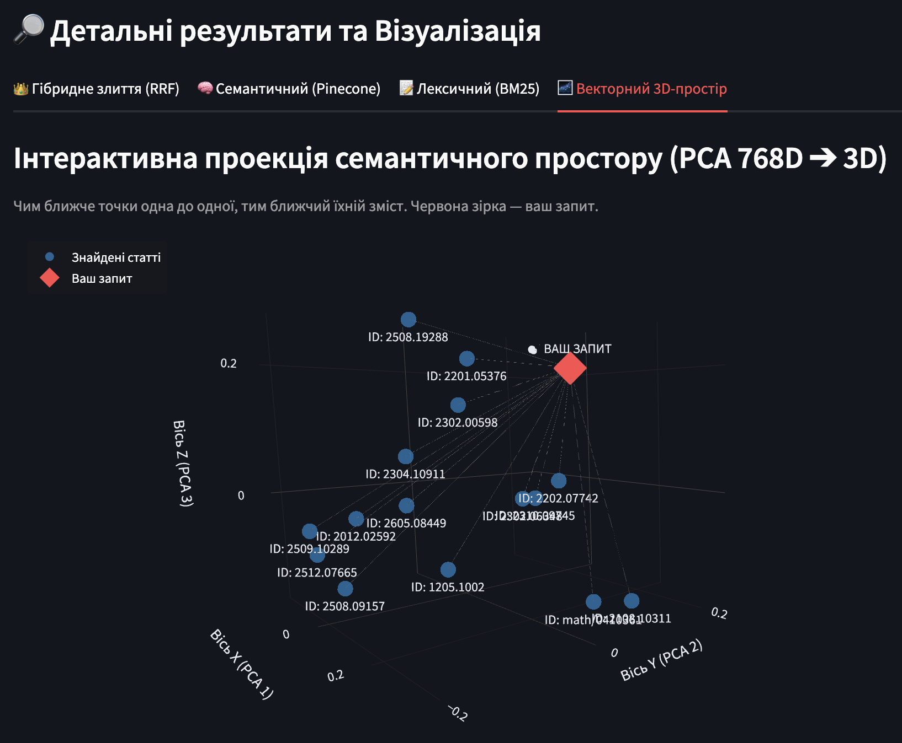
